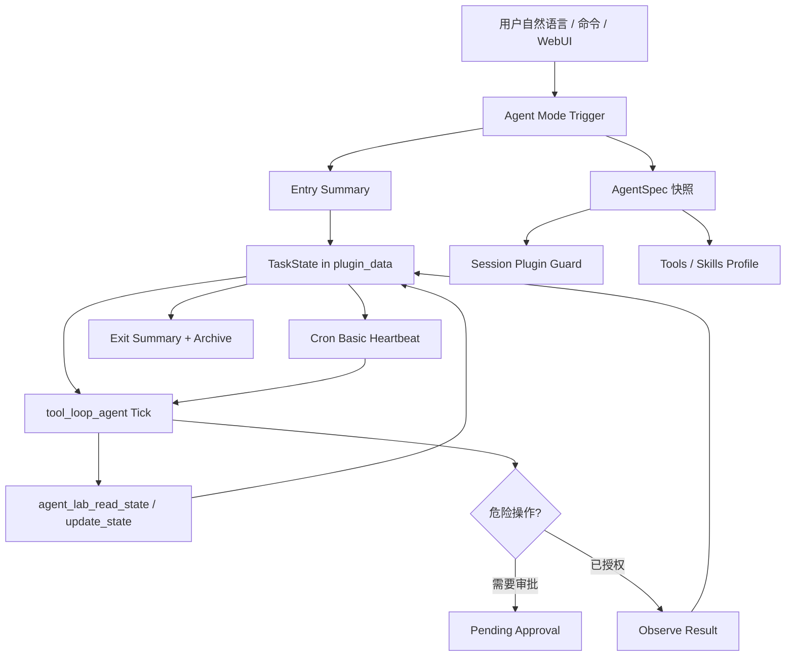

# Architecture

Agent Lab 的定位是 AstrBot-native Agent Mode runtime。



## 为什么不用全局关闭插件

AstrBot 的全局插件开关会 terminate 插件，并写入全局 shared preferences。Agent Mode 是会话状态，不应影响其他会话。

本插件优先使用 AstrBot 会话级插件配置：

```text
scope=umo
key=session_plugin_config
disabled_plugins=[...]
```

进入任务时保存快照，退出时恢复。

边界是：AstrBot 全局已经停用的插件仍然保持停用，Agent Mode 不负责也不能绕过全局插件管理把它重新启用。Agent Mode 只在当前会话里进一步收窄插件与工具可见性。

## 为什么不用 AstrBot active_agent cron 直接做心跳

AstrBot active agent cron 会唤醒主 Agent，并默认带入会话历史。Agent Lab 需要更干净的任务状态循环，所以使用 `add_basic_job` 调用插件的 `_heartbeat_tick`：

```text
payload = task_id + umo + state_path + root_goal + completion_conditions
```

payload 不携带具体代码细节，细节只从 task_state 读取。

## 为什么子代理编排不是主体

AstrBot SubAgentOrchestrator 负责把 subagent 变成 handoff tool。它适合分工，但不负责：

- 任务状态持久化。
- 入口/出口摘要。
- 插件隔离。
- 心跳续跑。
- 审批和归档。

所以 Agent Lab 作为主 runtime，subagent/handoff 作为可选集成蓝图。

## 显式读写状态

Agent Lab 不只在 tick 结束后自动保存最终回复，还暴露两个内部工具：

```text
agent_lab_read_state
agent_lab_update_state
```

长任务和心跳醒来时，Agent 应先读状态，再执行，然后用 `agent_lab_update_state` 写回进度、观察、下一步和阻塞点。

同时 `AgentLabRunHooks` 会记录工具开始、工具结束和 agent done 事件，作为审计日志写进 `progress_log`。
