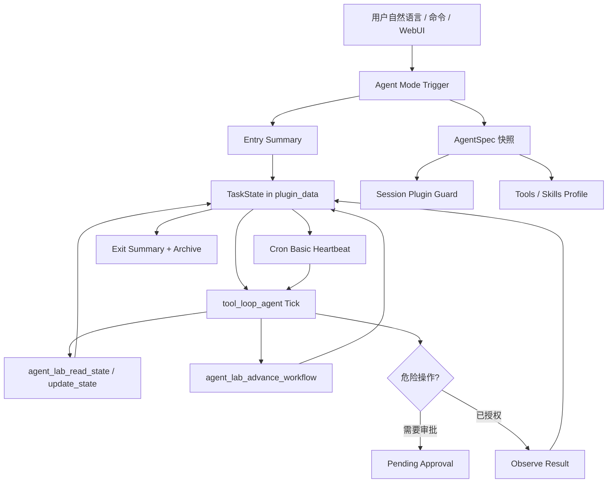

# Architecture

Agent Lab 的定位是 AstrBot-native Agent Mode runtime。



## 为什么不用全局关闭插件

AstrBot 的全局插件开关会 terminate 插件，并写入全局 shared preferences。Agent Mode 是会话状态，不应影响其他会话。

本插件优先使用 AstrBot 会话级插件配置：

```text
scope=umo
key=session_plugin_config
disabled_plugins=[...]
```

进入任务时保存快照，退出时恢复。

边界是：AstrBot 全局已经停用的插件仍然保持停用，Agent Mode 不负责也不能绕过全局插件管理把它重新启用。Agent Mode 只在当前会话里进一步收窄插件与工具可见性。

隔离模式分三档：

- `off`：不写会话级插件配置，只使用工具白名单约束。
- `session`：只应用用户在 AgentSpec 中显式配置的插件开关。
- `strict`：新配置默认值。当前会话默认关闭普通插件，只保留 Agent Lab、自身保护项、AstrBot 保留插件和用户显式允许的插件；退出时恢复进入前快照。

工具隔离分三档：

- `whitelist`：只暴露 AgentSpec 选择的工具和 Agent Lab 必要内部工具。
- `no_external`：只保留任务状态、审批、心跳、归档、任务记忆读取等内置能力。
- `full`：暴露当前可用工具集，但仍过滤内部危险递归工具和被隔离插件来源的工具。

## 为什么不用 AstrBot active_agent cron 直接做心跳

AstrBot active agent cron 会唤醒主 Agent，并默认带入会话历史。Agent Lab 需要更干净的任务状态循环，所以使用 `add_basic_job` 调用插件的 `_heartbeat_tick`：

```text
payload = task_id + umo + state_path + root_goal + completion_conditions
```

payload 不携带具体代码细节，细节只从 task_state 读取。

## 为什么子代理编排不是主体

AstrBot SubAgentOrchestrator 负责把 subagent 变成 handoff tool。它适合分工，但不负责：

- 任务状态持久化。
- 入口/出口摘要。
- 插件隔离。
- 心跳续跑。
- 审批和归档。

所以 Agent Lab 作为主 runtime，subagent/handoff 作为可选集成蓝图。

## 显式读写状态

Agent Lab 不只在 tick 结束后自动保存最终回复，还暴露两个内部工具：

```text
agent_lab_read_state
agent_lab_update_state
```

长任务和心跳醒来时，Agent 应先读状态，再执行，然后用 `agent_lab_update_state` 写回进度、观察、下一步和阻塞点。

同时 `AgentLabRunHooks` 会记录工具开始、工具结束和 agent done 事件，作为审计日志写进 `progress_log`。

tick 结束时不会直接用进入 tick 前的旧对象覆盖文件，而是重新读取最新 active task：如果工具已经调用 `agent_lab_update_state`，则保留工具写回的进度；如果工具已经调用 `agent_lab_finish` 完成归档，则不再重建 active task。

## 工作流画布

工作流不是独立替换 bot 的 Agent，而是 AgentSpec 里的任务模式路线图。运行时提示会把节点、连线、模块引用和节点提示词注入给当前 AstrBot 身份，让 bot 在进入任务模式后按画布执行入口摘要、隔离、计划、执行、审批、记忆和出口归档。

节点可绑定三类真实能力：

- AstrBot 插件模块：记录 `plugin_name`，受 AgentSpec 会话隔离约束，不能复活全局停用插件。
- 自定义 API 模块：记录 `api_id`，运行时通过 `agent_lab_call_custom_api` 调用已注册 API，凭证由后端注入。
- 工具模块：记录 `tool_name`，受工具白名单和来源插件状态约束。

WebUI 把“任务模式设置”和“工作流画布”拆开：设置页只管触发、隔离、记忆、审批、心跳和提示词；画布页是一个全屏背景式工作台，不再把流程图塞进页面卡片或模块内。普通顶栏、Token、刷新和连接反馈在画布页隐藏；当前方案、保存、检查、预跑、自动布局等操作以悬浮 HUD 叠在画布上。画布参考 Dify 的 Start/End/Tool 节点边界、n8n 的节点连接心智模型和 React Flow 的 handle/edge 交互：节点边框圆点支持拖拽连线和点选起点/终点连线，鼠标滚轮围绕指针缩放，空白处拖拽平移，画布本身没有内部滚动条。左侧导航进入画布时默认收缩，并提供独立小按钮展开；右侧素材抽屉负责添加模块，左键点击节点打开覆盖式编辑弹窗，不挤占画布空间。节点素材库按入口、隔离、输入、记忆、计划、并行、工具、API、安全、验证和出口分组，运行时插件/API/工具也能一键加入画布。

节点是拼图骨架加局部提示词，不是纯 prompt。结构化字段包括 `kind`、`stage`、`action`、`path/url`、`input_variable`、`output_variable`、`tags`、`condition`、`prompt`、`parallel_group` 和模块引用。开始/结束条件仍由 AgentSpec 的暗号、关键词、确认话术和退出暗号定义，但这些内容会落到入口/出口类节点里，方便在画布上查看和调整。

`agent_lab_update_workflow` 是 bot 可调用的结构化编辑工具。它支持检查、增删改节点、增删连线、自动布局、绑定插件/API/工具/skill，以及写入 `prompt`、`condition` 和 `parallel_group`。检查器和 `/api/workflow/dry-run` 预跑诊断会把缺少入口/出口、入口摘要、隔离快照、任务记忆、不可达节点、未绑定 API、文件/文档类节点缺少输入、危险动作缺少审批和无效模块引用标出来，避免前端画出来但后端无法解释。

运行中的任务会把画布落成可审计状态：

- `workflow_current_node_id`：当前执行到的节点。
- `workflow_path`：已走过的节点路径。
- `workflow_events`：每个节点的结果、下一节点和选择原因。

`agent_lab_advance_workflow` 只负责记录和推进游标，不替代实际工具/API 调用；它把 Dify/n8n 风格的可视化连线变成 Agent Lab 的 task_state 证据层。
`agent_lab_run_parallel_workflow` 负责把 `parallel_branch` 后续的独立工作包真正跑起来。API 节点复用已注册自定义 API 与凭证注入，提示词/插件/工具节点通过 AstrBot `tool_loop_agent` 以受限 ToolSet 执行；所有 worker 结果会写入 `parallel_runs`、`workflow_events`、快照和 Markdown。并行 worker 只产出证据和候选结论，主 Agent 仍要在汇总节点做冲突合并、验收和归档。

任务记忆也从普通任务控制台中拆出独立页面：它读取 `memories` registry，展示来源任务、标签、普通模式可读状态、续写入口草稿和归档回档入口。记忆节点负责保存/暴露任务记忆，记忆页负责人工审查、保留/拒绝/删除和把记忆或归档任务带入下一次任务。
